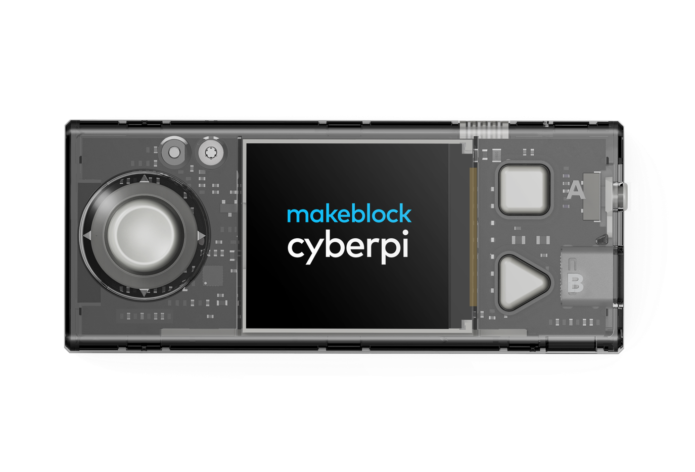

  

<h1 align="center">CyberPi Applications</h1>

  This repository stores the Python source code for CyberPi applications I created. 

## Prequisite

To run the code in this repository, you need to: 
1. Have a [CyberPi](https://education.makeblock.com/help/cyberpi-series-cyberpi/).
2. Install [mLink](https://mblock.makeblock.com/en-us/download/) and [mBlock 5](https://mblock.makeblock.com/en-us/download/) on your computer. Please refer to the [official operation guide](https://education.makeblock.com/help/cyberpi-series-cyberpi-operation-guide/) to download the required software.
3. Some application in this repository requires network connection to work properly, please use mBlock 5 to configure CyberPi's Wi-Fi connection.

## Running applications on CyberPi

Open the code in mBlock 5 Python editor and press upload button. **Be-careful that the upload operation will override the original program stored at the selected program slot.** 

For details of how this can be done, please refer to the [official operation guide](https://education.makeblock.com/help/cyberpi-series-cyberpi-operation-guide/).

## Useful reference
1. [APIs for CyberPi](https://education.makeblock.com/help/mblock-python-editor-python-api-documentation-for-cyberpi/)
2. [童芯派系列產品說明書](https://www.yuque.com/makeblock-help-center-zh/cyberpi/foreword)
3. [童芯派 Python API](https://www.yuque.com/makeblock-help-center-zh/mcode/cyberpi-api)